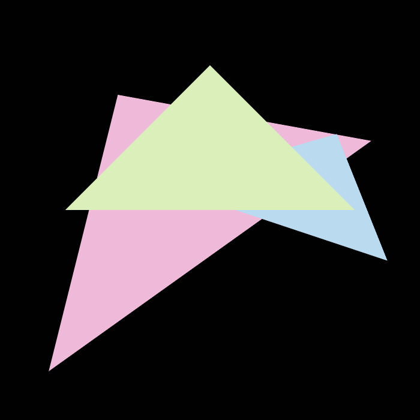
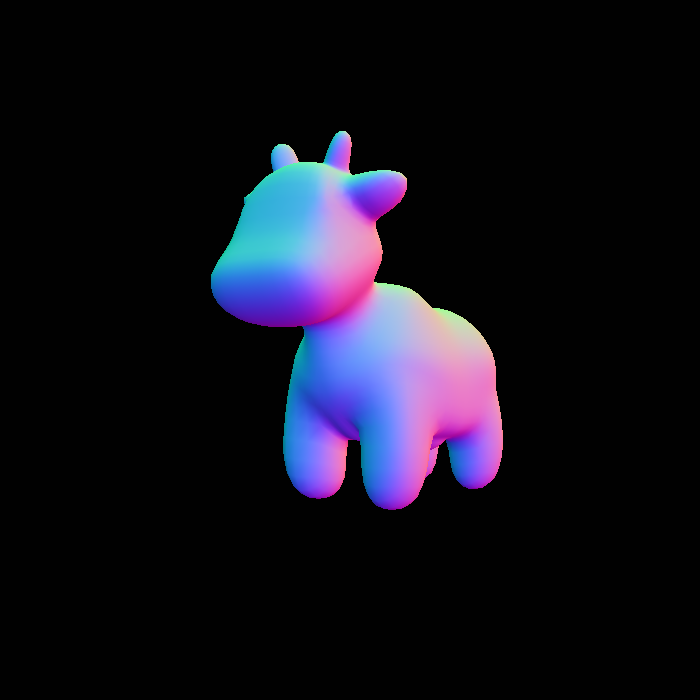
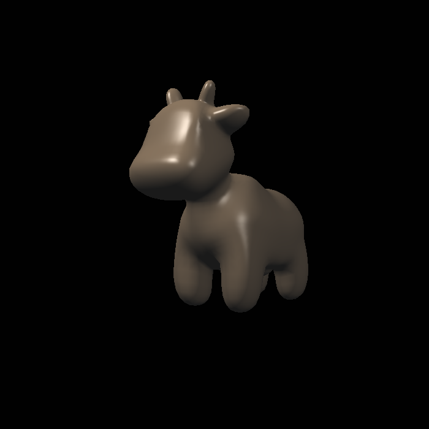
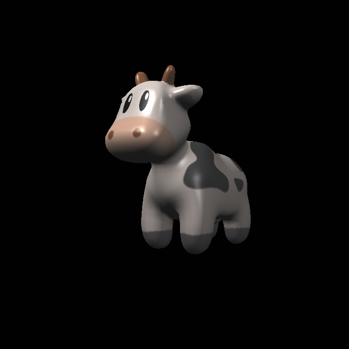
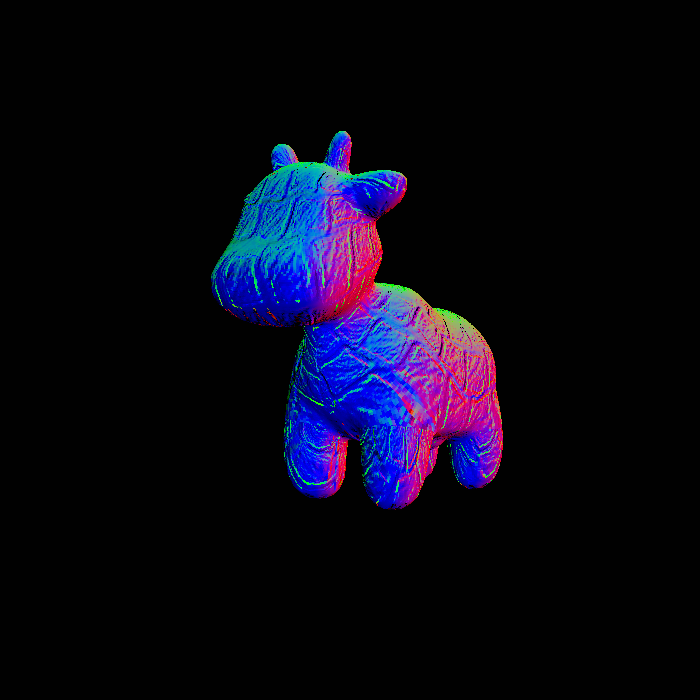
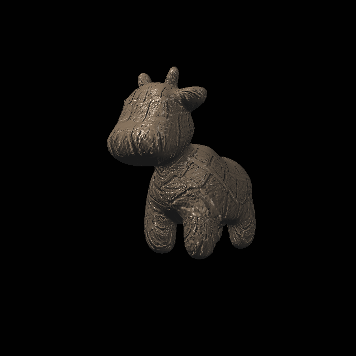
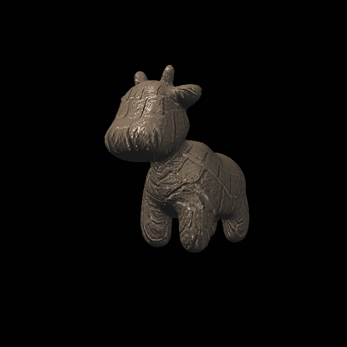

# Report of first week

## Lab1: 7ff558

实现了Model,View,Projection三个矩阵的计算

并实现任意轴旋转

## Lab2

### AABB: d7f0026

实现AABB以及Z-Buffer算法

效果如下:

可以看出有明显的锯齿，这是由于我们采样太少导致的：
对于一个像素，我们只单纯其中心点判断是否属于某个三角形，
显然浪费了许多信息，故而图像失真

### MSAA: 1ac3759

一种解决方案是增加采样点，原先一个像素采样一个点
现在采样四个取平均，那么精细度就提高了

### TSA: 46a7095

然而这样就多了渲染的时间开销

这个图片是不变的，那么我们可以将采样均摊到时间上，这就是TSA

## Lab3: 760dad8

采取不同方式实现了对环境光、漫反射光和镜面反射光的渲染，对贴图和凹凸贴图的处理，
并使用Bilinear插值优化贴图细节

