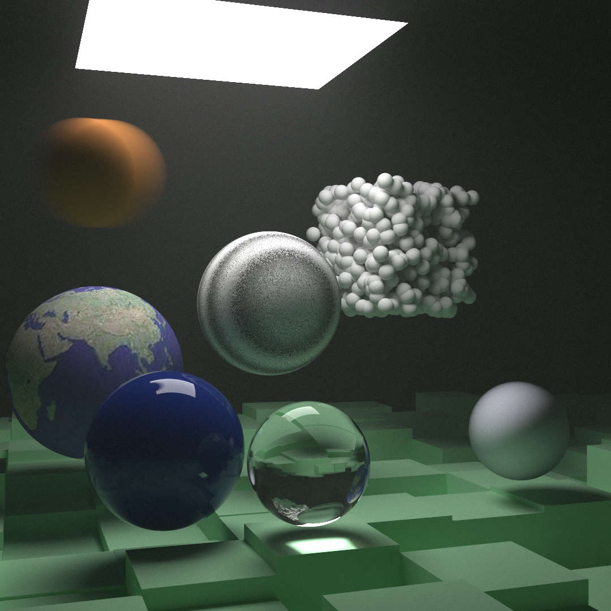

# Week3 Report:

## 运动模糊

基本原理是模拟快门开启时的光线，即令渲染的光线均匀分布在快门时间内。

## 体积框优化

没有必要对每个光线都检测所有物体。可以考虑使用一个框框住一组物体，
未命中框则不必检测组内物体。

这里我们令框为平行于坐标轴的立方体。分组可以使用KD树。

## 贴图

采用球坐标系，可以获得球上一点的二维坐标。
再通过伸缩获得贴图坐标，取得该处像素颜色即可。

## 柏林噪声

运用柏林噪声生成类似大理石的纹理。

## 平面图形

对于一个物体，主要要解决的问题是如何判断光线在何处相交。

对于一个平面，如果我们知道平面一点$\bold{Q}$,法向量$\bold{n}$,则光线$\bold{O} + t\bold{d}$有

$$
(\bold{O} + t\bold{d} - \bold{Q}) \cdot \bold{n} =0 \\
\Rightarrow
t = \frac{(\bold{O} - \bold{Q}) \cdot \bold{n}}{\bold{d} \cdot \bold{n}}
$$

法向量可以由两个平面内向量$\bold{u}, \bold{v}$叉乘得到

$$
\bold{n} = \bold{u} \times \bold{v}
$$

我们想把焦点$\bold{P}$用$\bold{Q}, \bold{u},\bold{v}$表示，得到二维坐标.

$$
\bold{p} = \bold{P} - \bold{Q} = \alpha \bold{u} + \beta \bold{v} \\
\Rightarrow
\begin{cases}
\bold{p} \times \bold{u} = \beta \bold{v} \times \bold{u} \\
\bold{p} \times \bold{v} = \alpha \bold{u} \times \bold{v}
\end{cases} \\
\Rightarrow
\begin{cases}
\bold{n} \cdot (\bold{p} \times \bold{u}) 
= \beta \bold{n} \cdot (\bold{v} \times \bold{u}) 
= -\beta \bold{n} \cdot \bold{n}\\
\bold{n} \cdot (\bold{p} \times \bold{v})
= \alpha \bold{n} \cdot (\bold{u} \times \bold{v})
= \alpha \bold{n} \cdot \bold{n}
\end{cases} \\
\Rightarrow
\begin{cases}
\alpha = \frac{\bold{n} \cdot (\bold{p} \times \bold{v})}{\bold{n} \cdot \bold{n}} \\
\beta = \frac{\bold{n} \cdot (\bold{u} \times \bold{p})}{\bold{n} \cdot \bold{n}}
\end{cases}
$$

对于平面一点是否位于图形内部，判断其平面坐标即可。

## 发光材质

为每种材质增加发光的属性，默认为全黑。

光线的颜色是发光与反光的和。

## 旋转与平移

对于一个物体，我们有时想要对其进行旋转和平移。

思路是让坐标系旋转或平移，这样更加容易。

## 体积雾

雾的效果是通过光的散射获得的。

我们通过一个Hittable指定雾的边界，通过公式

$$
\Delta t = \frac{-ln(rand(0, 1))}{\rho}
$$

计算光线偏折的位置。

## Final

