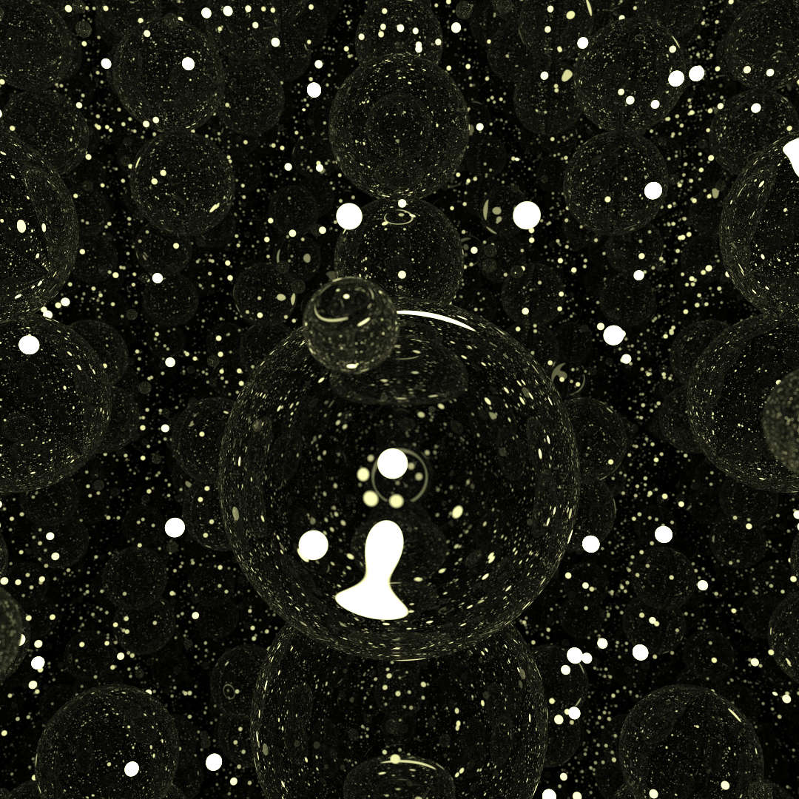
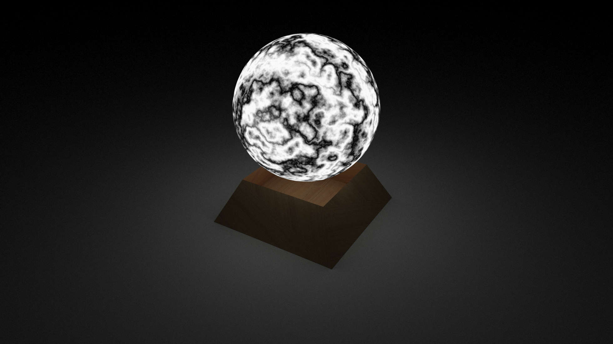
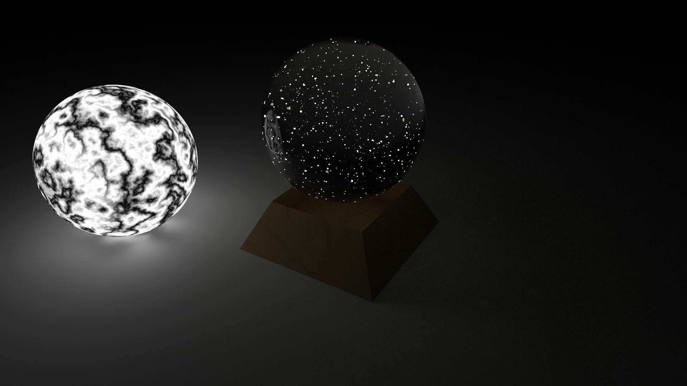

# Week4 Report: 580a958

## Jittering

在采样时使用stratifying,即将采样像素划分为若干小格，在其中采样。

## Triangle and Non-parallel Quads

在平行四边形的基础上实现了三角形的渲染，并利用三角形组合任意四边形。

## Some Artistic Scene

渲染了一些有趣的图片

这张照片将若干玻璃球与点光源置于镜子盒中，形成类似于星空的效果。

这张照片利用噪声纹理制作了效果不错的氛围灯。

这张照片则尝试渲染一张水晶球的照片，其中基座是四边形和木质纹理贴图，球体是玻璃材质，球内随机生成若干点光源。
